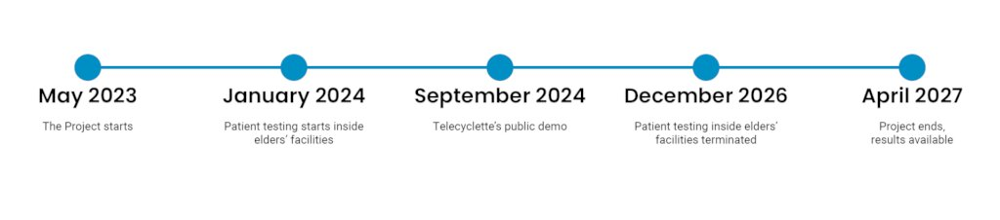

# Telecyclette

Telecyclette is a real-time biking experience that lets older adults venture into the outdoors while remaining at home or inside assisted living facilities. Through virtual reality and high-speed live video streaming, the system creates the sense of telepresence on board a bike actually ridden by a real biking buddy.

This repository is the umbrella workspace for the project. The actual software lives in the submodules and companion folders, each of which implements one part of the system. The root repository exists to keep the project organized and to provide a single entry point for the overall architecture.

## Project Overview

The Telecyclette project was developed to address isolation and affective impoverishment among older adults living in assisted facilities. Moving from the tenets of Self-Determination Theory, it aims to stimulate motivation to well-being by leveraging outdoor motor activity together with social and affective relationships.

The system is built around a live, bidirectional setup:

- the indoor rider pedals on a stationary bike while wearing a virtual reality headset
- the outdoor cyclist rides a real bike equipped with a 360-degree action camera, microphones, and a loudspeaker
- a high-speed live streaming layer transmits audio and video in real time
- the VR client renders the ride and preserves the feeling of telepresence
- a signaling backend coordinates sessions, device connectivity, and call state

The project also includes research and study components. It was designed as part of a randomized controlled trial that evaluates the effects of the Telecyclette experience on health, motivation, and well-being over time.

## Repository Structure

The root folder contains the following project areas:

- [Telecyclette-Server/](https://github.com/telecyclette/Telecyclette-Server) - Node.js signaling and coordination backend
- [Telecyclette-Smartphone/](https://github.com/telecyclette/Telecyclette-Smartphone) - Android companion app for the smartphone side of a Telecyclette session
- [Telecyclette-Camera/](https://github.com/telecyclette/Telecyclette-Camera) - Android camera plug-in for the outdoor bicycle camera unit
- [Telecyclette-VR/](https://github.com/telecyclette/Telecyclette-VR) - VR client used for the immersive rider experience
- [matlab_anyconnect_vpn/](https://github.com/gavril0/matlab_anyconnect_vpn) - MATLAB-related support material for VPN connectivity
- [matlab_redcap_api/](https://github.com/gavril0/matlab_redcap_api) - MATLAB-related support material for REDCap integration

The submodules are the real repositories. This main repository is meant to collect them in one place and provide shared project-level documentation.

## Components

### Telecyclette Server

The server is the signaling and coordination layer of the system. It manages WebRTC session setup, routes Socket.IO messages, tracks device connections, and exposes web interfaces for configuration and monitoring.

Typical responsibilities include:

- peer discovery and session establishment
- WebRTC signaling for VR headsets, cameras, and smartphones
- dynamic session parameters such as bitrate, resolution, codec, and FPS
- cycling speed and session data logging
- admin dashboards and API endpoints for configuration and retrieval

### Telecyclette Smartphone App

The Android smartphone app coordinates a Telecyclette session from the mobile side. It connects to the signaling backend, exchanges WebRTC messages, handles reconnection and call state, and collects session telemetry such as GPS and connection statistics.

### Telecyclette Camera Application

The camera application runs on the outdoor camera device and streams live audio and video from the buddy's bike. It connects to the signaling backend, establishes the WebRTC session, and reports call status and telemetry during the ride.

### Telecyclette VR Client

The VR component provides the immersive experience for the indoor rider. It receives the live stream from the outdoor bike and renders the remote ride inside a headset so that the user experiences the buddy's route in real time.

## System Concept

At a technical level, Telecyclette combines three main layers:

1. A real-world sensing and streaming layer on the outdoor bike.
2. A coordination and signaling layer in the server.
3. A viewing and interaction layer in the indoor VR setup.

This separation keeps the device-specific code isolated while allowing the system to operate as one connected session. It also makes the architecture easier to extend, for example by introducing new device types or future versions such as more interactive remote control.

## Research Context

The project was conceived for assisted living environments, where social isolation and reduced activity are common challenges. The research goal is to understand whether a shared outdoor biking experience can support motivation, motor activity, and broader bio-psycho-social well-being over time.

In addition to the immediate user experience, the project explores the role of:

- increased motivation to exercise
- social and affective connection with family or friends
- augmented visual exploration in VR
- real-world longitudinal health outcomes

## Learn More

General project information is available at:

https://www.telecyclette.eu/the-project/

## Notes

Each submodule may have its own build instructions, environment requirements, and runtime configuration. For implementation details, refer to the README or documentation in the corresponding submodule.
